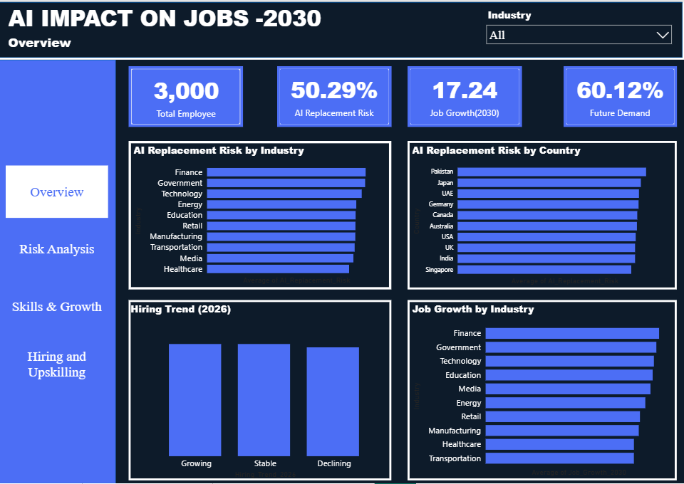
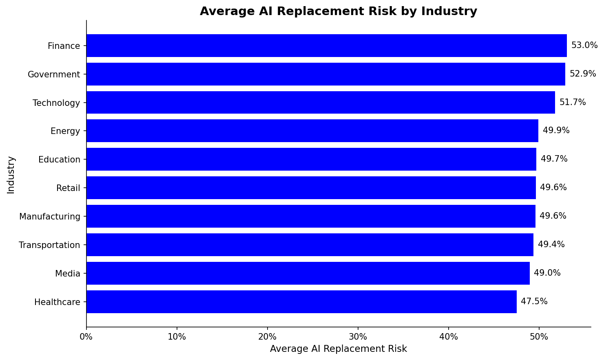
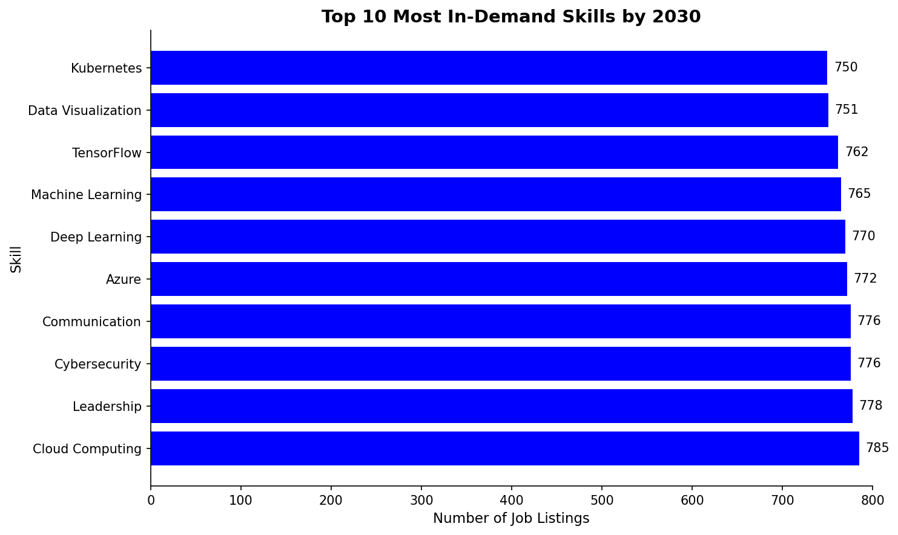
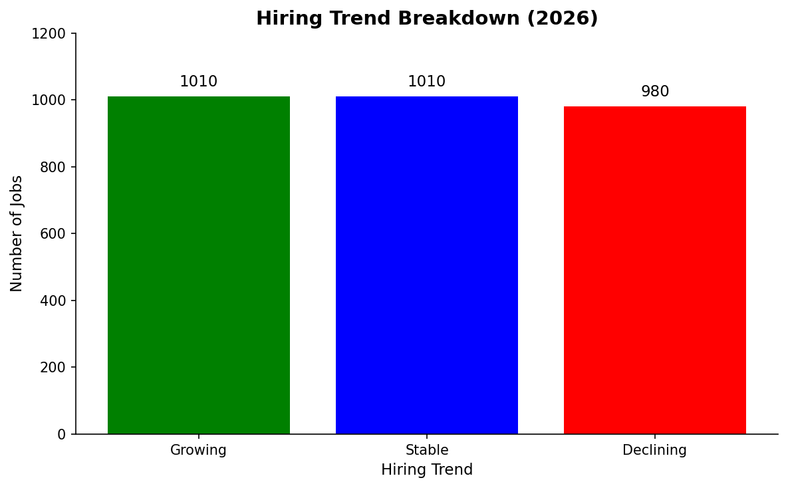
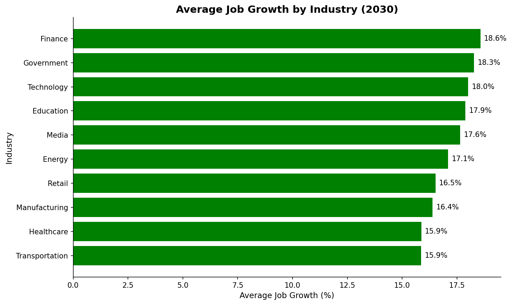

# 🤖 AI Impact on Jobs 2030

An end-to-end data analysis project examining how Artificial Intelligence is reshaping the global workforce by 2030 — covering 3,000 employee records across 10 industries and 10 countries.

---

## 📌 Project Overview

This project analyses the impact of AI on global employment using a dataset of 3,000 workers. The goal is to identify which industries, job titles, and countries face the highest AI replacement risk, understand hiring trends, and uncover which skills will be most in demand by 2030.

---

## 🎯 Key Questions Answered

- Which industries and job titles carry the highest AI replacement risk?
- Which countries have the most exposed workforce?
- What skills are most in demand by 2030?
- How is AI affecting hiring trends — are more jobs growing or declining?
- Are high-risk workers more likely to need upskilling?

---

## 📊 Key Findings

- **Finance** is the highest-risk industry at **53.0%** average AI replacement risk
- **Healthcare** is the most insulated industry at **47.5%**
- **Pakistan** has the highest country-level risk at **52.6%**, while **Singapore** is the safest at **48.5%**
- **Cloud Computing** is the most in-demand skill, appearing in **785** job listings
- AI disruption is **broadly distributed** — the spread across all industries is only **5.5%**, suggesting no single sector is immune
- **1,010 jobs are Growing**, **1,010 are Stable**, and **980 are Declining** — indicating AI is reshaping rather than eliminating work
- **Finance** simultaneously has the highest AI risk and the highest projected job growth by 2030 — the most disrupted sector will also create the most new roles

---

## 🗂️ Project Structure

```
AI IMPACT ON JOBS/
│
├── AI_Impact_on_Jobs_2030.csv       # Raw dataset
├── cleaned_data.csv                 # Preprocessed dataset
├── AI_Job_Impact.ipynb              # Full EDA notebook
├── Dashboard.pbix                   # Power BI dashboard file
│
├── visuals/
│   ├── chart1_industry_risk.png
│   ├── chart2_jobtitle_risk.png
│   ├── chart3_top_skills.png
│   ├── chart4_hiring_trend.png
│   ├── chart5_correlation_heatmap.png
│   ├── chart6_country_risk.png
│   ├── chart7_job_growth.png
│   └── chart8_upskilling.png
│
└── dashboard/
    ├── 1.Overview.png
    ├── 2.Risk Analysis.png
    ├── 3.Skills & Growth.png
    └── 4.Hiring and Upskilling.png
```

---

## 🛠️ Tools Used

| Tool | Purpose |
|------|---------|
| Python (pandas, matplotlib, seaborn) | Data cleaning, EDA, visualisation |
| Jupyter Notebook | Analysis documentation |
| Power BI | Interactive dashboard |
| GitHub | Version control and portfolio hosting |

---

## 📈 Dashboard Preview

### Page 1 — Overview


### Page 2 — Risk Analysis


### Page 3 — Skills & Growth


### Page 4 — Hiring & Upskilling


---

## 📉 EDA Charts Preview

### AI Replacement Risk by Industry


### Top 10 In-Demand Skills by 2030


### Hiring Trend Breakdown


### Job Growth by Industry 2030


---

## 🚀 How to Run

1. Clone the repository
```bash
git clone https://github.com/MemuAnalyzes/AI-IMPACT-ON-JOBS.git
```

2. Install required libraries
```bash
pip install pandas matplotlib seaborn
```

3. Open the notebook
```bash
jupyter notebook AI_Job_Impact.ipynb
```

4. For the Power BI dashboard, open `Dashboard.pbix` in Power BI Desktop

---

## 👤 Author

**Memuletiwon Oluwafemi**
Data Analyst | Python · SQL · Power BI · Excel

[](https://www.linkedin.com/in/memufem)

---

## 📌 Dataset

The dataset contains 3,000 records with 20 columns covering employee demographics, AI risk scores, salary, skills, job growth projections, and hiring trends across 10 industries and 10 countries.
